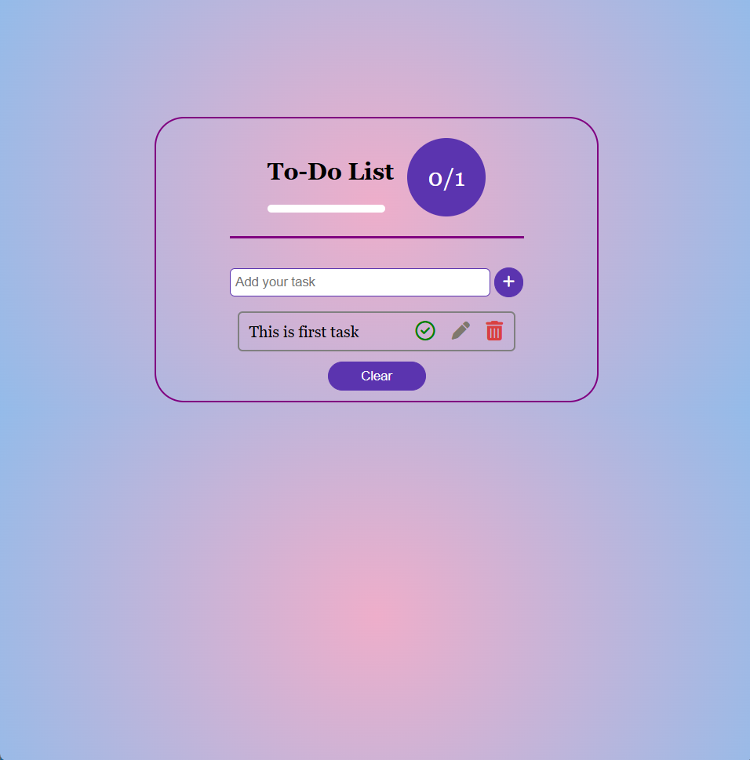

# 📝 To-Do List App

A simple and interactive **To-Do List Web App** built using **HTML, CSS, and JavaScript**.  
It helps you add, edit, check, delete, and clear tasks with a progress tracker.

---

## 🚀 Features

- ➕ Add new tasks
- ✔ Mark tasks as completed
- ✏ Edit existing tasks
- 🗑 Delete tasks
- 🧹 Clear all tasks with one click
- 📊 Progress bar with task completion ratio
- 🎉 Celebration when all tasks are completed

---

## 📂 Project Structure

├── index.html # Main HTML file
├── styles.css # Styling for the app
├── script.js # Functionality with JavaScript
└── README.md # Documentation

## 🛠️ Tech Stack

- **HTML5** – Structure
- **CSS3** – Styling (Flexbox & Responsive design)
- **JavaScript (Vanilla JS)** – App logic

---

## 📸 Preview

---

### Future Improvements

- Save tasks to Local Storage (so they persist after refresh).

- Add Due Dates & Reminders.

- Add Dark Mode.
